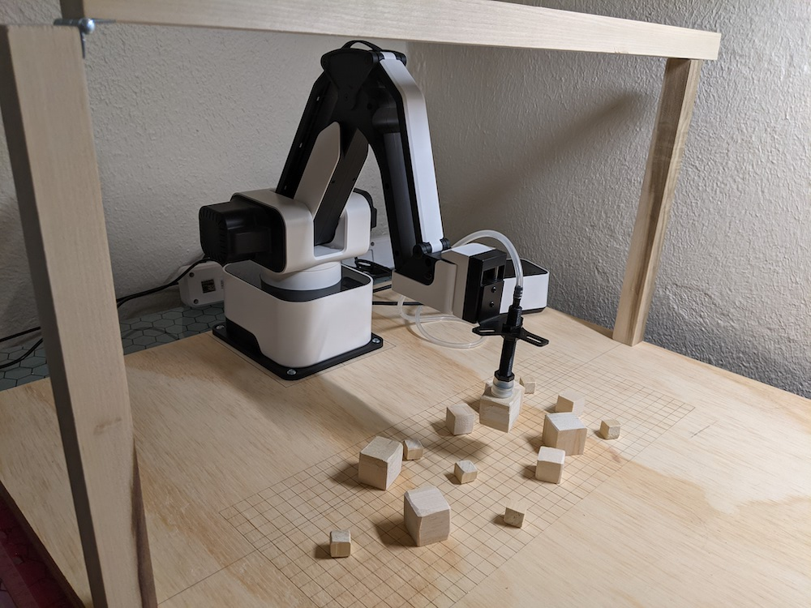

The following are materials and setup instructions for a very simple educational "arm farm" based on a Rotrics DexArm and a Raspberry Pi.

## Arm Farm Hardware Setup
**Table**: 
- $11.52: [2ft x 2ft block of wood](https://www.homedepot.com/p/Sanded-Plywood-Common-23-32-in-x-2-ft-x-2-ft-Actual-0-703-in-x-23-75-in-x-23-75-in-300950/202093835)
- $3.68 * 2: [1in x 36in Wood dowel](https://www.homedepot.com/p/8316U-1-in-x-36-in-Hardwood-Square-Dowel-10001818/203334085)
- $2.18: [1in hinge](https://www.homedepot.com/p/Everbilt-1-in-Zinc-Plated-Non-Removable-Pin-Narrow-Utility-Hinges-2-Pack-15161/202034166)
- $8.47: [1/4in magnets](https://www.homedepot.com/p/Master-Magnet-1-4-in-Dia-Neodymium-Rare-Earth-Magnet-Discs-with-Foam-Adhesive-12-Pack-97584/206503481)
- *Misc*: 1 1/4 to 1 1/2 in screws
- *Misc*: 4 3/4 in screws
- *Misc*: Superglue or equivalent

*Construction*
1. Cut 1ft off a dowel and then reconnect with the hinge
2. Cut 1ft off the second dowel.
3. Attach 1ft dowels from bottom at opposite edges (x-axis) of the board approximately in the middle (~1ft) from edges (y-axis) using the longer screws.
4. *optional*: Drill a small divet in center of the top of dowel that doesn't have a hinge and glue in a magent
5. *optional*: Mark where the hinged dowel lands on top of the magnet and drill out a small indent to place second magnet (this helps w/ alignment)
6. Remove rubber pads from Rotrics robot and screw into the edge of the board (shorter screw) -- again centered

*Cost*: 
$25.85 or ~$30 with glue and screws and <1hr of labor

*Grid*: 
Execute [Wide Grid GCode](gcodes/WideGrid.gcode) or import two adjacent copies of [Grid svg](gcodes/WideGrid_half.svg) to burn a 400mm wide by 160mm tall grid onto the table. Note: Use 90% of laser or lines will be very light/spotty.

**Robot is [Rotrics DexArm](https://www.rotrics.com/products/dexarm)**:
- $999 USD for Luxury Kit (incl pneumatic gripper and laser) or 
- $659 USD for Base kit + $259 USD for [Pneumatic Gripper](https://www.rotrics.com/products/pneumatic-kit)

**Blocks**
Small blocks can me made by cutting up the remaining Dowel 

**Overhead Light**
Recommend some overhead or bar lamp lighting (minimal shadows) to evenly light the surface

## Arm Farm Compute
**Computer**: 
- $119.95 for a [Raspberry Pi 4](https://www.canakit.com/raspberry-pi-4-4gb.html) Kit with 4GB of RAM
- $29.95 for [8mp Raspberry Pi Camera](https://www.canakit.com/raspberry-pi-noir-camera-v2-8mp.html)
- $5.40 for [1meter camera cable](https://smile.amazon.com/gp/product/B07J57LQQS?pf_rd_r=XAAVCRCQN91EM9JG6Y1Q&pf_rd_p=5ae2c7f8-e0c6-4f35-9071-dc3240e894a8)
- *Misc* $26.99 for [USB/Bluetooth Keyboard & Mouse](https://smile.amazon.com/gp/product/B07LH6TZSZ/ref=ppx_yo_dt_b_asin_title_o05_s00?ie=UTF8&psc=1)
- *Misc* $84.99 for [Small touchscreen](https://smile.amazon.com/gp/product/B07L6WT77H/ref=ppx_yo_dt_b_asin_title_o05_s01?ie=UTF8&psc=1) is completely unnecessary

*Cost*:
$155.30 or ... more if you buy more stuff

## Camera Connect
- *Cheap*: Tape or Zip-ties
- *A little more*: 3D printed clips see [CAD Directory](CAD) for files.  These can be easily printed and and tiled around the provided 3D printer platform if DexArm attachment was purchased:

## Rotrics Code

`python manual.py` for issuing individual test commands

`python send-gcode.py` iterates through a gcode file (doesn't wait properly)

`python range.py` calculate statistics about a gcode file for helping with placement and draw image/path
